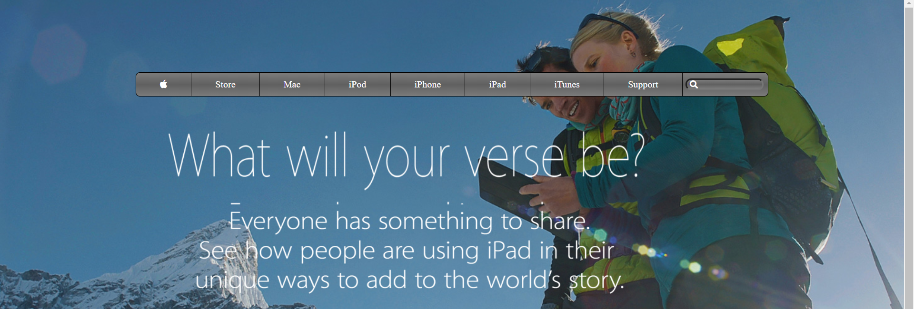
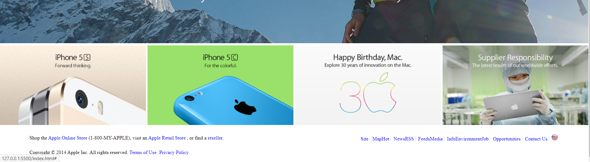

> # The old apple website clone
>
> This is a replica of a the sign-up form in the Intuit website. The page is fully responsive. On smaller screens,the navbar dissapears and the form takes up most of the screen.

## Built With

- HTML and CSS,

## Live Demo

[Live Demo Link](https://apple-replica1.netlify.app/)

## Getting Started

Download or clone the repository and open with any text editor.

## Authors

👤 **Sinework Shiferaw**

- Github: [@githubhandle](https://github.com/sinework)
- Twitter: [@twitterhandle](https://twitter.com/@SineworkShiferaw)
- Linkedin: [linkedin](https://linkedin.com/SineworkShiferaw)

👤 **Ntwali Heritier**

- Github: [@githubhandle](https://github.com/NtwaliHeritier)

- Twitter: [@twitterhandle](https://twitter.com/NtwaliHeritier)

- Linkedin: [linkedin](https://linkedin.com/in/ntwali-heritier-9950001a2)
